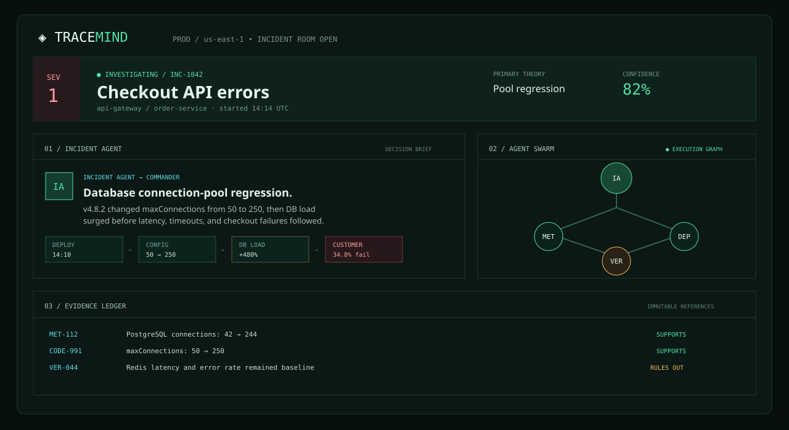
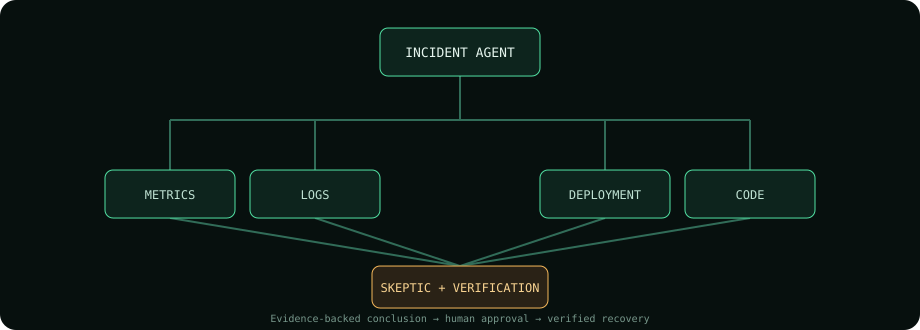

# TraceMind

[](https://nodejs.org/)
[](#how-it-works)
[](#safety-boundary)

TraceMind is an evidence-first AI on-call engineering team. It runs specialized workers against structured observability, deployment, code, database, and infrastructure tools; persists every result; asks a skeptic to challenge the leading explanation; and requires explicit approval for consequential operations.



## Why TraceMind?

Traditional observability tools show signals. TraceMind connects them into an auditable engineering decision: what changed, what failed first, which hypotheses were challenged, and what action is safe to take next.

| An alert tells you | TraceMind answers |
| --- | --- |
| Checkout failures are rising | Which services and customers are affected? |
| A deploy happened nearby | Did it cause the failure, or is it correlation? |
| Redis changed first | What evidence rules it in or out? |
| A rollback may help | Is it safe, approved, and verified afterward? |

## Huawei openJiuwen Multi-Agent Challenge alignment

> **Track path:** customized multi-agent application for a real-world engineering workflow.

TraceMind is built for the core challenge question: **when a high-stakes incident is ambiguous, how can a team of agents get to a safe, evidence-backed result faster than one assistant can?** It is not a chain of differently named prompts. An Incident Agent coordinates independent specialists, preserves their messages and evidence in a shared state model, and changes the investigation when the team discovers uncertainty.

| Challenge capability | How TraceMind demonstrates it |
| --- | --- |
| **Task decomposition** | The Incident Agent converts an incident into metrics, logs, deployment, code, database, and infrastructure investigation tasks. |
| **Role specialization** | Each specialist owns a distinct evidence source and returns typed findings; the Skeptic Agent has the deliberately different job of trying to falsify the leading hypothesis. |
| **Agent communication** | Structured messages include sender, recipient, type, body, timestamps, and evidence IDs. The Swarm Radio exposes this collaboration in the product. |
| **Tools and Skills** | Agents use permissioned tools for metrics, logs, deployment history, Git diffs, database health, infrastructure events, repository context, and structured external ingestion. |
| **Parallel execution** | Independent evidence agents run concurrently through the orchestration engine before synthesis. |
| **Dynamic coordination** | The Skeptic Agent creates a new Verification Agent task when a plausible competing cause—such as a Redis change—needs to be resolved. |
| **Result verification** | An independent Gemini review can cross-check OpenAI synthesis; the Verification Agent tests the competing explanation against primary evidence. |
| **Safety and recovery** | Consequential operations are modeled as persisted actions that require human approval. The system never silently rolls back a service or creates an external ticket. |
| **Reusable collaboration pattern** | The agent registry, evidence schema, scenario library, tool-permission policy, and evaluation suite make the investigation workflow reusable across incident classes. |

### Why this is a strong openJiuwen / WorkSwarm fit

The challenge encourages **leader-driven decomposition, specialized teammates, tool invocation, dynamic collaboration, and reusable Swarm workflows**—the exact collaboration pattern TraceMind implements for on-call engineering. TraceMind uses the challenge’s valid **customized application** path: its orchestration is deliberately portable and maps directly to a WorkSwarm Leader (Incident Agent), teammates (specialist agents), Skills/tools (evidence adapters), and a reusable incident-investigation workflow. This lets a team run the product today while keeping the collaboration contract ready for WorkSwarm deployment.

### Judge checklist: what to watch in the demo

1. Start the **connection-pool regression** scenario and watch six specialist agents fan out in parallel.
2. Follow their structured evidence into the Evidence Ledger—not a model’s unsupported prose.
3. Watch the Skeptic Agent challenge the obvious explanation with the competing Redis change.
4. See the Incident Agent dynamically dispatch Verification, rule Redis out with evidence, and request—not perform—a rollback.
5. Approve the action, verify recovery, then export the postmortem or prepare an approval-gated GitHub follow-up Issue.

## Run locally

```bash
npm run dev
```

The server hosts the web workspace and API at `http://localhost:4173`. It creates `tracemind.db` locally on first run.

## How it works



1. The **Incident Agent** opens an evidence-first investigation and dispatches specialists concurrently.
2. Metrics, Logs, Deployment, Code, Database, and Infrastructure agents return structured findings with evidence IDs.
3. The **Skeptic Agent** challenges the leading explanation and creates a targeted **Verification Agent** task.
4. The commander sees a recommended action, reviews the evidence trail, and explicitly approves or rejects remediation.
5. TraceMind verifies recovery, prepares follow-up work, and preserves the full audit trail.

## Under the hood

- **SQLite source of truth**: incidents, tasks, evidence, findings, hypotheses, messages, actions, approvals, and timeline events.
- **Concurrent agent orchestration**: metrics, logs, deployment, code, database, and infrastructure agents run concurrently. The skeptic then adds a dynamic verification task.
- **Evidence provenance**: every finding has immutable evidence IDs; the agent never presents an inference as a fact.
- **Safety boundary**: tool permissions are modeled explicitly. Rollback is created as a pending action and can only run in the simulator after approval.
- **Streaming**: the server exposes incident-scoped Server-Sent Events for agent activity, findings, and completion.
- **Six simulated environments**: connection-pool regression, Redis outage, bad application deploy, external dependency outage, resource saturation, and dual faults.

## Safety boundary

| Capability | Examples | Behavior |
| --- | --- | --- |
| Read | Logs, metrics, Git history, database health | Agents can use automatically |
| Analyze | Correlate events, build hypotheses, prepare a rollback | Agents can use automatically |
| Consequential | Rollback, restart, production configuration, GitHub Issue creation | Requires a persisted human approval |

No agent can silently execute a protected action. Every proposed action, decision, and evidence reference is preserved in SQLite.

## Model providers

The product runs its deterministic, structured simulated environment with no credentials. If keys are provided, OpenAI is used for evidence-constrained incident synthesis and Gemini independently reviews the evidence without receiving the primary conclusion.

```bash
export OPENAI_API_KEY=...
export OPENAI_MODEL=gpt-5
export GEMINI_API_KEY=...
export GEMINI_MODEL=gemini-3.8-flash
npm install
npm run dev
```

The OpenAI adapter uses the Responses API with strict JSON Schema output and `store: false`. Gemini loads its current official `@google/genai` SDK only when configured; it is an optional dependency so local simulation has no installation requirement.

## API

```text
GET  /api/scenarios
POST /api/incidents                 { "scenario": "connection_pool" }
GET  /api/incidents/:id
GET  /api/incidents/:id/events      (SSE)
POST /api/incidents/:id/chat        { "message": "What changed?" }
POST /api/incidents/:id/approve     { "actionId": "act_..." }
POST /api/incidents/:id/ingest      { "source": "datadog", "records": [...] }
GET  /api/incidents/:id/report      (evidence-cited Markdown postmortem)
GET  /api/incidents/:id/audit       (approval and policy audit)
GET  /api/evaluations               (six-scenario safety/evaluation suite)
```

## Demo script

1. Start with **Database connection-pool regression** in the scenario selector.
2. Watch specialists fan out in the Swarm Radio and Evidence Ledger.
3. Point out the Skeptic Agent's Redis challenge and the Verification Agent's counter-evidence.
4. Approve the simulated rollback; TraceMind verifies recovery.
5. Copy the evidence-cited postmortem or queue a GitHub follow-up Issue for approval.

## CLI and tests

```bash
./tracemind serve
./tracemind incident simulate incident.json --failure metrics-api
./tracemind trace INC-1042
npm test
```

The tests cover persisted agent results, skeptic-triggered verification, the approval boundary, scenario coverage, and tool-permission metadata.
